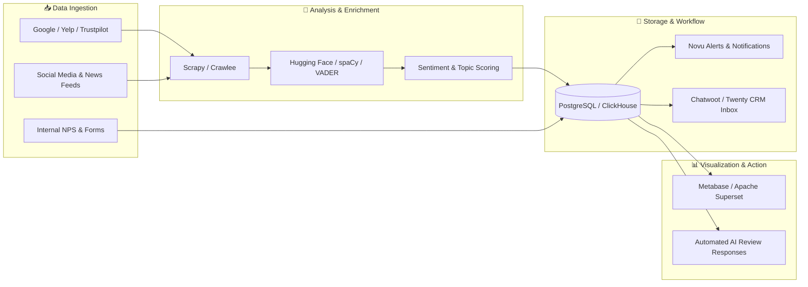

# 🛡️ Awesome Reputation Management ⭐

**Curated Ecosystem of Top SaaS Platforms & Open-Source Projects for Online Reputation Management (ORM)**

*Real-Time Review Monitoring, Automated AI Response, Review Generation, Listings Management, Brand Listening & Customer Sentiment Analysis*

     

**Last updated: September 2026**

---

## 📖 Overview & SEO Index

Welcome to the **Awesome Reputation Management** directory — the premier curated guide to modern **Online Reputation Management (ORM)** software, customer review generation platforms, social listening monitors, and open-source sentiment analysis tools. 

Whether you are a local service business, multi-location franchise, marketing agency, or software engineer building custom feedback pipelines, this repository catalogs both market-leading enterprise SaaS suites and developer-friendly open-source alternatives.

### 🔍 Key Capabilities Covered:
- **🌟 Review Monitoring & Multi-Channel Aggregation**: Real-time tracking of customer reviews across Google Business Profile, Facebook, Yelp, Trustpilot, TripAdvisor, and industry-specific portals.
- **🤖 Automated AI Review Response**: LLM-driven personalized review responses, routing workflows, and crisis escalation alerts.
- **📲 Review Generation & Invite Automation**: SMS and email review request funnels with high conversion rates.
- **🧠 Customer Sentiment Analysis & NLP**: Aspect-based sentiment analysis, customer satisfaction (CSAT) scoring, and Net Promoter Score (NPS) tracking.
- **📍 Local SEO & Directory Listings Management**: Automated synchronization of NAP (Name, Address, Phone) data across 50+ publisher directories.
- **📡 Brand Listening & Web Mentions**: Tracking social media mentions, blog posts, news articles, and forum discussions.

---

## 📑 Table of Contents

- [🏢 SaaS Reputation Management Platforms](#-saas-reputation-management-platforms)
- [💻 Open-Source GitHub Projects](#-open-source-github-projects)
- [🏗️ Architectural Blueprint for Custom Pipelines](#️-architectural-blueprint-for-custom-pipelines)
- [🤝 How to Contribute](#-how-to-contribute)
- [⭐ Star History](#--star-history)
- [⚖️ Disclaimer](#️-disclaimer)

---

## 🏢 SaaS Reputation Management Platforms

> 📊 **Sector Market Size & Structure**: The global Online Reputation Management (ORM) market is estimated at **$7.75 billion in 2026** (projected to exceed $15 billion by 2033 at a ~11% CAGR). The market structure is **moderately fragmented to moderately concentrated**: while enterprise-level review orchestration and multi-location governance are consolidating around top category leaders (such as Podium, Birdeye, and Reputation), the broader sector remains fragmented with hundreds of specialized niche providers for local SEO, review scrapers, PR crisis monitoring, and industry-specific aggregators.

*Sorted descending by company size (Valuation / Revenue scale):*

| Platform | Company Scale (Valuation / Rev) | Description | Pricing | Free Tier / Trial Limits |
| :--- | :--- | :--- | :--- | :--- |
| **[Podium](https://www.podium.com/)** | **~$3.0B Valuation** (~$220M Annual Revenue) | Text-first customer communication and review generation platform strong for local service businesses and review requests via SMS. | Starts at ~$399/mo (Core tier, 1 location; Pro tier starts at ~$599/mo) | No free-forever plan; offers a 14-day free trial (no credit card required; includes 1 location, review generation, and core SMS customer messaging tools). |
| **[Birdeye](https://birdeye.com/)** | **~$1.0B+ Valuation** (~$100M+ ARR) | All-in-one reputation, reviews, listings, messaging, and customer experience platform widely used by multi-location businesses. | Starts at ~$299/mo (Starter tier, billed annually for 1 location; Growth tier at ~$399/mo) | No free-forever plan; offers a 30-day free trial for Birdeye Social (requires connecting &ge;1 social profile; no credit card required) or a 14-day sales-assisted trial for the reputation platform upon demo request. |
| **[Reputation.com](https://www.reputation.com/)** | **~$330M–$500M Valuation** (~$100M+ ARR) | Enterprise reputation management platform focused on multi-location governance, review analytics, surveys, and reputation scoring. | Starts at $80/location/mo (Rep Core plan; Rep Core + Pulse tier starts at $115/location/mo) | No free-forever plan; provides a free single-location Brand Reputation Report & Audit, plus a 30-day free trial for select modules (e.g., Social Publishing) via sales demo. |
| **[ReviewTrackers](https://www.reviewtrackers.com/)** | **~$70M–$75M Valuation** (~$15M–$25M Revenue) | Review monitoring and analytics platform known for broad site coverage, reporting, and customer feedback insights. Acquired by InMoment. | Starts at ~$49–$89/location/mo (Starter/Essential monitoring tier) | No free-forever plan; offers a 7-to-14-day guided free trial upon demo request (limited to 1 location and review tracking across major review sites). |
| **[Brand24](https://brand24.com/)** | **~$28M–$30M Market Cap** (~$10M Annual Revenue) | Online brand monitoring and social listening tool for tracking mentions, sentiment, and reputation signals across the web and social media. Majority-owned by Semrush (WSE: B24). | Starts at $199/mo (billed annually) or $249/mo (billed monthly) (Individual plan: 3 keywords, 2,000 mentions/mo; Team tier at $299/mo) | 14-day free trial (no credit card required; includes up to 3 keywords and live mention tracking across web and social channels; no free-forever plan). |
| **[Broadly](https://broadly.com/)** | **~$25M–$30M Valuation** (~$8.5M Revenue) | Customer experience and review platform helping local businesses collect and manage feedback across channels. Acquired by Vendasta. | Starts at $79/mo (standalone Reputation Management module) or $399/mo (Standard complete suite) | 30-day free trial (no credit card required; full access to review generation workflows and customer inbox tools; no free-forever plan). |
| **[Mention](https://mention.com/)** | **~$20M–$25M Valuation** (~$6M–$10M ARR) | Social listening and brand monitoring platform that tracks mentions, sentiment, and online conversations. Subsidiary of Mynewsdesk / NHST. | Starts at $599/mo (Company Plan, billed annually; includes 5 alerts & 50,000 mentions/mo) | 14-day free trial (no credit card required; includes basic alert setup and trial mention monitoring; no free-forever plan). |
| **[NiceJob](https://get.nicejob.com/)** | **~$15M–$20M Valuation** (~$5M–$8M Revenue) | Review generation and reputation platform popular with service businesses for automated review requests and monitoring. Acquired by Paystone. | Starts at $75/mo (Standard Reviews plan, up to 2,500 customer contacts; Pro plan at $125/mo) | 14-day free trial (no credit card required; full access to automated review invitations, review monitoring, and social sharing for 1 location; no free-forever plan). |
| **[Grade.us](https://grade.us/)** | **~$10M–$15M Valuation** (~$2.3M–$3M Revenue) | Review generation and management platform focused on helping businesses collect more positive reviews. Subsidiary of Traject / GatherUp. | Starts at $110/mo (Solo tier for 1 seat/profile; Professional tier at $180/mo for 3 seats) | 14-day free trial (no credit card required; access up to 3 seats/profiles, review funnels, review monitoring, and email/SMS campaigns; no free-forever plan). |
| **[LocalClarity](https://localclarity.com/)** | **~$2M–$5M Valuation** (~$440K–$1M Revenue) | Local reputation and review management platform aimed at multi-location brands and agencies. Bootstrapped and independent. | Starts at $10–$16/location/mo (Google Only at $10/loc/mo; Professional tier at $16–$20/loc/mo) | 14-day free trial (no credit card required; includes unlimited users, competitor tracking, review inbox, and full analytics reporting; no free-forever plan). |

---

## 💻 Open-Source GitHub Projects

Open-source reputation and review management repositories provide the building blocks for teams engineering self-hosted, privacy-first monitoring stacks. Below is a curated collection spanning **NLP sentiment models**, **web crawling & review scrapers**, **BI analytics dashboards**, **omnichannel inboxes**, **survey forms**, and **content moderation systems**.

*Sorted descending by GitHub stargazers count:*

- **[Transformers](https://github.com/huggingface/transformers)**   
  State-of-the-art machine learning and NLP framework with pre-trained models for customer sentiment analysis, review classification, summarization, and automated response generation.

- **[Apache Superset](https://github.com/apache/superset)**   
  Modern enterprise data exploration and business intelligence visualization platform for building multi-channel customer sentiment dashboards and review volume analytics.

- **[Scrapy](https://github.com/scrapy/scrapy)**   
  Fast high-level web crawling and screen scraping framework in Python, commonly used for extracting public review datasets and mentions across diverse web directories.

- **[Twenty](https://github.com/twentyhq/twenty)**   
  Modern, open-source CRM platform designed for AI, enabling teams to track customer relationships, satisfaction milestones, and client review feedback touchpoints.

- **[Huginn](https://github.com/huginn/huginn)**   
  Open-source automation agent system that monitors online channels, blogs, and RSS feeds for brand mentions, review triggers, and web sentiment changes.

- **[Metabase](https://github.com/metabase/metabase)**   
  Intuitive open-source business intelligence and embedded reporting tool that connects to review databases to visualize NPS scores, star rating trends, and feedback velocity.

- **[Novu](https://github.com/novuhq/novu)**   
  Open-source notification infrastructure enabling automated multi-channel alerts (Slack, SMS, email, webhook) when new customer reviews or critical brand mentions arrive.

- **[PostHog](https://github.com/PostHog/posthog)**   
  Comprehensive product analytics and user feedback suite equipped with in-app surveys, CSAT polls, session replay, and qualitative feedback capture.

- **[Chatwoot](https://github.com/chatwoot/chatwoot)**   
  Open-source customer engagement and support desk platform for centralizing incoming customer messages, handling negative reviews, and coordinating multi-channel brand support.

- **[spaCy](https://github.com/explosion/spaCy)**   
  Industrial-strength natural language processing toolkit for Python, ideal for entity recognition, customer sentiment tagging, and large-scale review text categorization.

- **[Crawlee](https://github.com/apify/crawlee)**   
  Web scraping and browser automation library (Playwright/Puppeteer/Cheerio) designed to reliably crawl complex, dynamic single-page web applications for customer ratings and reviews.

- **[NLTK](https://github.com/nltk/nltk)**   
  Foundational Python NLP toolkit providing classic tokenization, sentiment analysis, part-of-speech tagging, and corpus linguistics tools for review analytics.

- **[Flair](https://github.com/flairNLP/flair)**   
  Lightweight state-of-the-art NLP framework for PyTorch that allows applying contextual string embeddings for highly accurate customer sentiment classification.

- **[Formbricks](https://github.com/formbricks/formbricks)**   
  Open-source survey and experience management suite that enables businesses to gather customer feedback, run Net Promoter Score (NPS) surveys, and prevent negative public reviews.

- **[TextBlob](https://github.com/sloria/TextBlob)**   
  Simplified Python library providing quick sentiment analysis (polarity and subjectivity scoring) on raw customer feedback and review text.

- **[VADER Sentiment](https://github.com/cjhutto/vaderSentiment)**   
  Valence Aware Dictionary and sEntiment Reasoner—a rule-based sentiment analysis model specifically tuned for social media mentions, emojis, and customer review text.

- **[Google Maps Scraper](https://github.com/omkarcloud/google-maps-scraper)**   
  Automated tool for extracting local business profile data, customer star ratings, and review comments from Google Maps.

- **[Coop](https://github.com/roostorg/coop)**   
  Open-source content moderation dashboard and rule-based review routing engine designed to manage review responses, flagged messages, and user-submitted ratings.

---

## 🏗️ Architectural Blueprint for Custom Pipelines

1. **Collect Public Mentions & Reviews**: Ingest reviews and social mentions via permitted platform APIs, RSS feeds, or headless browser crawlers ([Crawlee](https://github.com/apify/crawlee), [Scrapy](https://github.com/scrapy/scrapy)).
2. **Execute Sentiment Analysis**: Run text through NLP classification pipelines ([Transformers](https://github.com/huggingface/transformers), [spaCy](https://github.com/explosion/spaCy), or [VADER](https://github.com/cjhutto/vaderSentiment)) to assign emotional polarity, urgency ratings, and topical tags.
3. **Trigger Real-Time Alerts**: Route negative feedback or viral mentions through notification hubs ([Novu](https://github.com/novuhq/novu)) directly to team Slack or Discord channels.
4. **Coordinate Response Workflows**: Dispatch issues to support desks ([Chatwoot](https://github.com/chatwoot/chatwoot)) or CRM accounts ([Twenty](https://github.com/twentyhq/twenty)) for personalized responses.
5. **Analyze Macro Trends**: Visualize sentiment velocity, aggregate star ratings, and review volume across stores using self-hosted BI dashboards ([Metabase](https://github.com/metabase/metabase), [Apache Superset](https://github.com/apache/superset)).

---

## 🤝 How to Contribute

We welcome contributions from developers, agency owners, and reputation managers! 🚀

1. 🍴 **Fork the repository**.
2. 🌿 **Create a new branch**: `git checkout -b add-reputation-platform`.
3. 📝 **Add your entry to `README.md`**:
   - For SaaS products: include Platform name, Company Scale (Valuation/Revenue), Description, Starting Tier Price, and specific Free Tier / Trial limits.
   - For Open-Source projects: include Repo link, star badge (`style=social&color=white` linking to stargazers), and 1–2 sentence description. Maintain descending star order.
4. 📬 **Submit a Pull Request** with a clear explanation of your additions.

For more awesome lists, check out [Awesome-Awesome-Awesome](https://github.com/ishandutta2007/Awesome-Awesome-Awesome)!

---

##  Star History

---

## ⚖️ Disclaimer

- 🛡️ **Community Curated**: This repository is maintained as an independent community resource and does not represent an endorsement of any commercial platform or open-source software listed.
- 📜 **Compliance & Terms**: When scraping or monitoring public review feeds, ensure strict compliance with target platform Terms of Service (ToS), Google API guidelines, robots.txt directives, and local privacy regulations (GDPR, CCPA).
- 🚫 **Anti-Fake Review Notice**: Manipulating review scores, astroturfing, generating fraudulent testimonials, or review gating violates FTC regulations and major search engine policies. Use reputation tools ethically to capture genuine customer sentiment.

---

  Built with ❤️ for local businesses, marketing teams, and developers building transparent customer trust.

